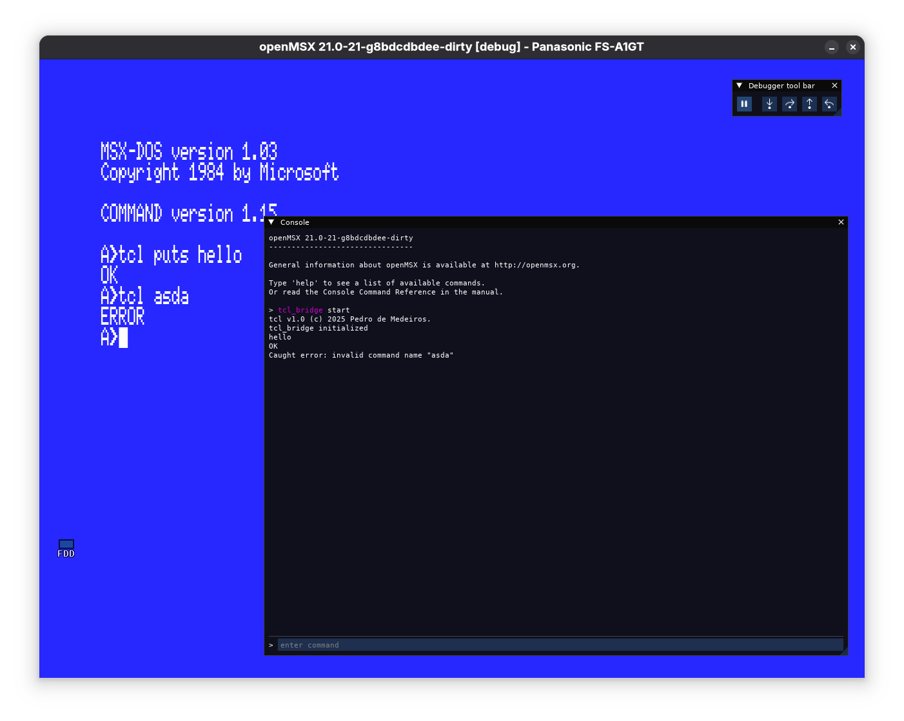

openmsx-tcl-bridge
==================

Guest machine side of mechanism that connects MSX-DOS to OpenMSX Tcl environment. This program uses the **Programmable Device** extension to send responses back from Tcl to MSX-DOS, so it requires at least OpenMSX version 21.0.

How to use it
-------------

The **tcl.com** MSX-DOS program requires the **tcl_bridge.tcl** script on OpenMSX side to execute Tcl commands received by the program. Execute:
```
tcl_bridge start
```
on the Tcl console to connect the receiving and sending ports on the MSX side (ports 6 and 7 respectively). Now you can for instance call:
```
tcl puts Hello world
```
on MSX-DOS command line to print "Hello world" on openMSX Tcl console, but you can use it to call `diskmanipulator` and automate stuff using OpenMSX. The sky is the limit!

To close the bridge, just execute:
```
tcl_bridge stop
```
